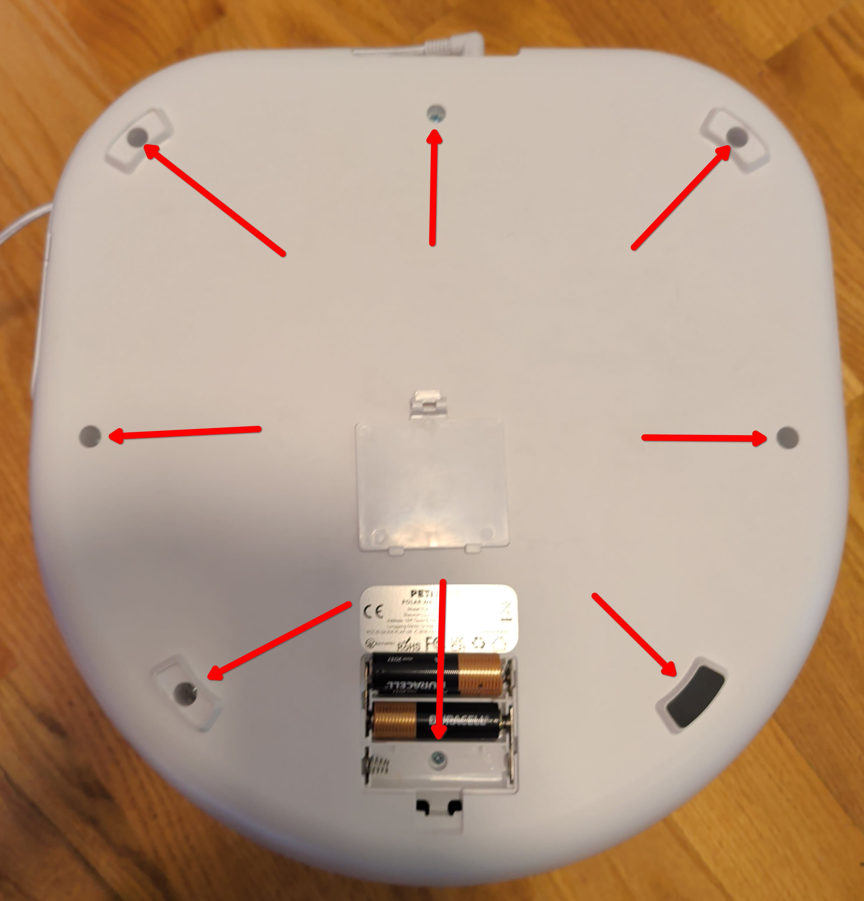
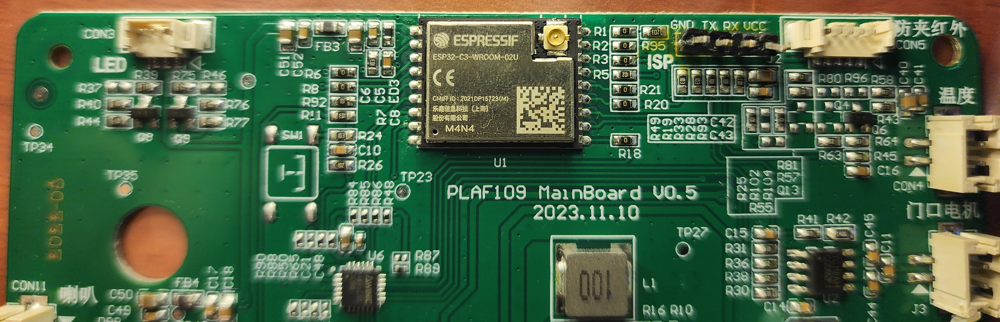
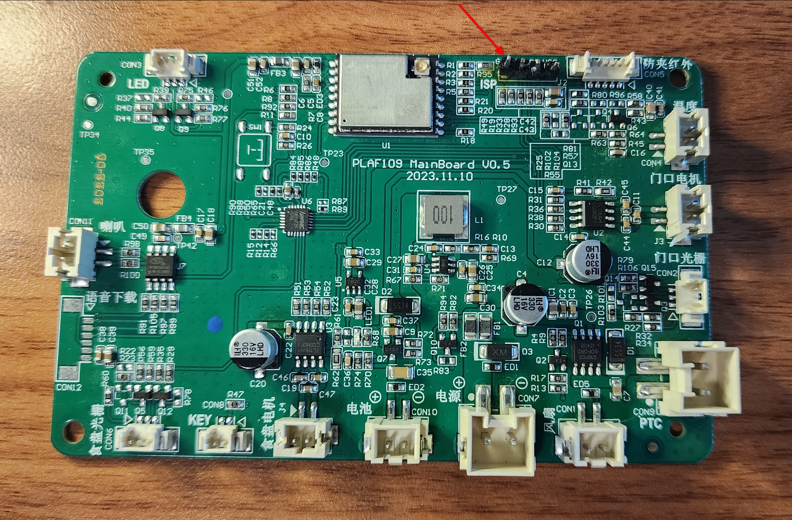
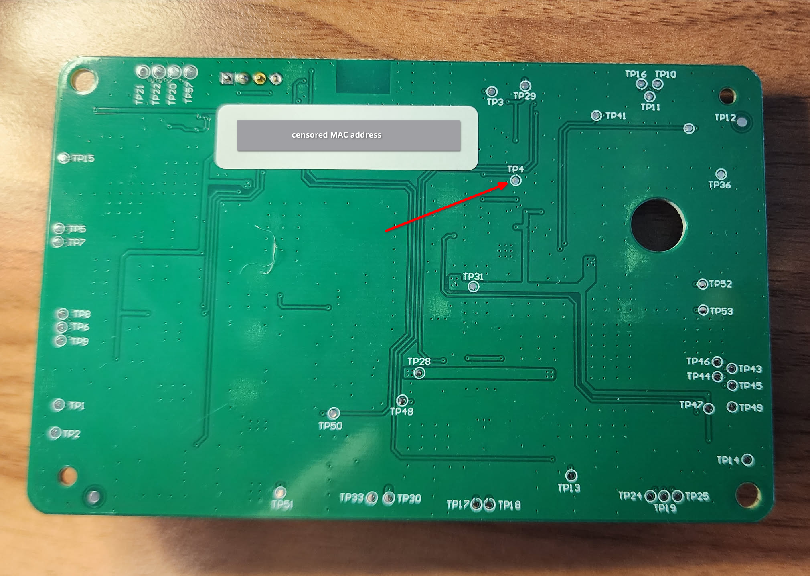

# PLAF109: Polar Wet Food Feeder

## Supported Features

Functions:

- reset button
  - restarts esphome when held for more than 2s
- automatic cooling to target temperature
  - option to manually disable cooling
  - automatically disables when power is lost to preserve power
  - NOTE: unsure about the utility of setting a target temperature
- feed now
  - plays chime
  - opens door, if not already open
  - waits for pet to arrive, up to a configurable timeout
    - optionally repeats chime at a configurable interval
  - if pet arrived
    - keeps door open for a configurable minimum feeding time after arrival
    - then waits till pet has been gone for 10s
    - closes door, if not manually closed
    - rotates plate
  - logs if pet arrived or not
  - closes door, if not already closed
- daily feeding schedule, stored on-device
  - feeds front plate, then rotates AFTER meal
  - uses same flow as manual feed, no special handling
  - warns when a meal is missed (plate is not rotated in this case)
    - warning survives reboots, is cleared at midnight or by a successful manual feed
- open/close lid
  - will only close when pet is not present
  - using encoder to ensure lid opens/closes fully
- rotate plate
  - using encoder to ensure alignment
- presence sensor
  - daily visits and time at feeder
  - last visit time and duration
- status led
  - switch turns the white led on or off
  - pulses white while wifi is disconnected
  - pulses red while a missed meal warning is active, alternating red/white if wifi is also disconnected
  - warnings override the switch
- play chime

Sensors:

- battery voltage sensor
  - displays charge percentage, using factory formula
- ac power detection
  - may take several seconds to update after unplugged
- chamber temperature
  - not confident this is accurate, may need more calibration
  - uses factory formula

### To-Do

- use of motor current to detect stall
- maybe warn when a manual plate rotation offsets the feeding schedule
- scheduled meals will not trigger if set in close proximity (under 10-15m apart), maybe queue?
- better calibration of temp sensor, if possible
- bring some features to other devices
- support for feeding schedules for multiple days

## Disassembly

To access the motherboard, unscrew all visible screws on the bottom of the device. Remove all four feet and the battery cover, unscrewing those hidden screws as well. You do not need to unscrew the fan vent on the side.

Carefully unclip the bottom cover. The battery, power, and reset cables will need to be disconnected to completely remove the cover. I recommend doing so and only reconnecting the power later for flashing, if you don't trust your serial adapter provides enough power to VCC.

When re-assembling, ensure all connectors are firmly in place. If you remove the motherboard, use caution disconnecting the headers. Mine were secured with hot-glue and very difficult to disconnect without damage.

*Please note that if you disassemble further for any reason: if you remove the cooling fins and TEC plate (ceramic sandwich under it), it is critical you put it back in the same orientation, or you may accidentally cook your food or even cause a housefire from heat buildup. You have been warned.*

## Connecting via Serial

The PLAF109 uses an [`ESP32-C3-WROOM-02U`](https://documentation.espressif.com/esp32-c3-wroom-02_datasheet_en.html#%5B12,%22XYZ%22,56.69,436.45,null%5D) and a `aw9523` I2C GPIO expander, and unlike the PLAF108 it has no exposed pads to short to easily enter programming mode.

Wire `GND`/`TX`/`RX` to the `GND`/`TX`/`RX` headers on the motherboard, as with the other devices. For this device, you'll also need a full RS232 serial adapter with DTR/RTS lines to get into programming mode, see "Entering Programming Mode" below. I recommend carefully soldering headers onto at least these three connectors, see my messily soldered headers below:

## Entering Programming Mode

Hold `DTR` to `GPIO9` and `RTS` to `EN` while connecting or powering the board. Pulling `GPIO9` low on first power-up as well helps ensure it takes.

`TP4` on the back of the board is a convenient test point for `GPIO9`, so you can connect `DTR` there instead of soldering directly to the chip, but you'll need to carefully disconnect all wires and unscrew the motherboard to access it.

*While I did hold `RTS` to `EN`, you might just need to hold `DTR` to `GPIO9` per the chip manual. I ended up soldering a lead to `TP4` for easy access once re-connected. If you are very brave, you could solder directly to the chip leads, but this may damage your board. I did so only for GPIO sniffing as I could not find test points for GPIO7/8 (pins used for the I2C expander).*

Fig 1. A helping-hands tool held the pins in place for flashing, ignore the resistor used for testing.

## Data Provenance

In order to gain feature parity with the stock app, I used a combination of dumping and reverse engineering the factory firmware and I2C sniffing (see [main README](../README.md#adding-a-new-device)).
