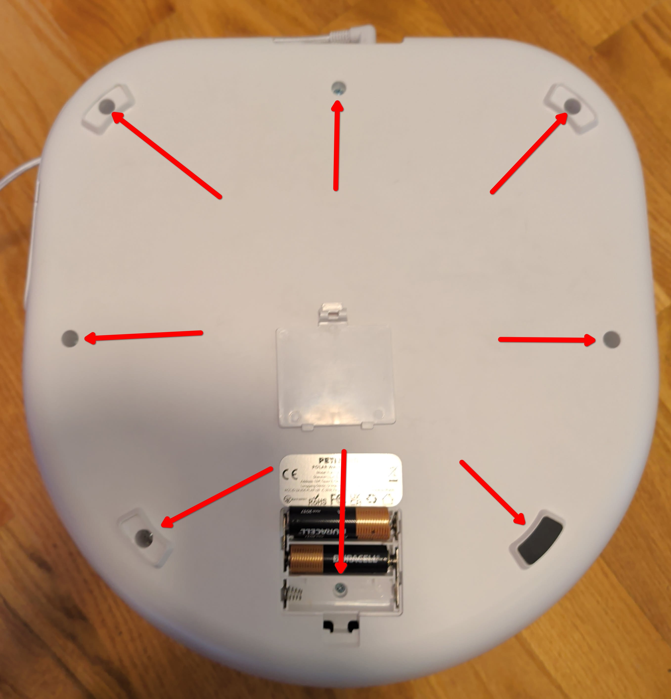
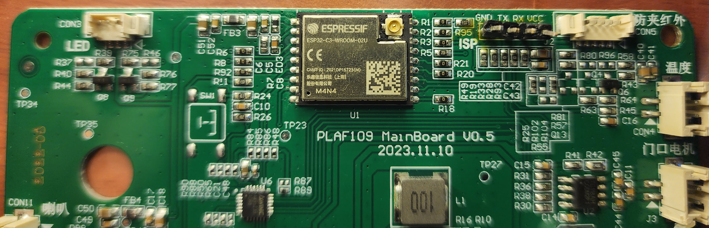
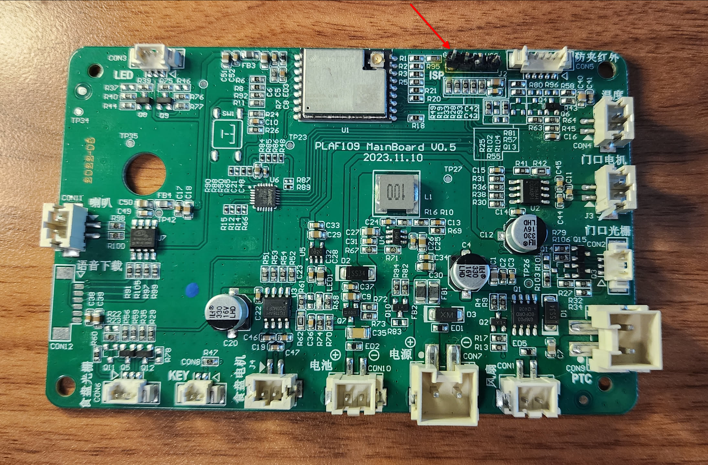
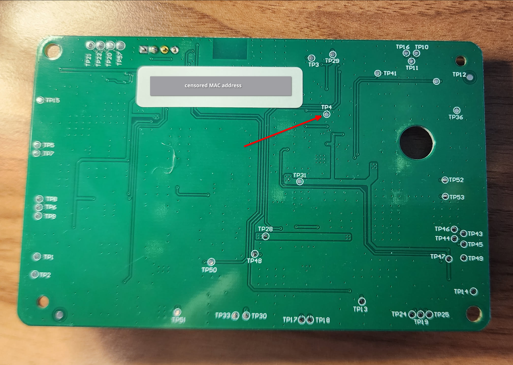

# PLAF109: Polar Wet Food Feeder

## Supported Features

### On-Device Web Dashboard

This device has an optional custom UI that is enabled by default, source code at [sylphrena0/petlibro-esphome-plaf109-ui](https://github.com/sylphrena0/petlibro-esphome-plaf109-ui).


Note that screenshot uses mocked data (this feeder doesn't seem to get that cold).

### Functions

- reset button
  - restarts esphome when held for more than 2s
- automatic cooling to target temperature
  - option to manually disable cooling
  - automatically disables when power is lost to preserve power
  - NOTE: unsure about the utility of setting a target temperature
- feed now
  - plays chime
  - opens door, if not already open
  - waits for pet to arrive, up to a configurable timeout
    - optionally repeats chime at a configurable interval
  - if pet arrived
    - keeps door open for a configurable minimum feeding time after arrival
    - then waits till pet has been gone for 10s
    - closes door, if not manually closed
    - rotates plate
  - logs if pet arrived or not
  - closes door, if not already closed
- daily feeding schedule, stored on-device
  - feeds front plate, then rotates AFTER meal
  - uses same flow as manual feed, no special handling
  - warns when a meal is missed (plate is not rotated in this case)
    - warning survives reboots, is cleared at midnight or by a successful manual feed
- open/close lid
  - will only close when pet is not present
  - using encoder to ensure lid opens/closes fully
- rotate plate
  - using encoder to ensure alignment
- presence sensor
  - daily visits and time at feeder
  - last visit time and duration
- status led
  - switch turns the white led on or off
  - pulses white while wifi is disconnected
  - pulses red while a missed meal warning is active, alternating red/white if wifi is also disconnected
  - warnings override the switch
- play chime

### Sensors

- battery voltage sensor
  - displays charge percentage, using factory formula
- ac power detection
  - may take several seconds to update after unplugged
- chamber temperature
  - not confident this is accurate, may need more calibration
  - uses factory formula

### To-Do

- use of motor current to detect stall
- maybe warn when a manual plate rotation offsets the feeding schedule
- scheduled meals will not trigger if set in close proximity (under 10-15m apart), maybe queue?
- better calibration of temp sensor, if possible
- bring some features to other devices
- support for feeding schedules for multiple days

## Disassembly

To access the motherboard, unscrew all visible screws on the bottom of the device. Remove all four feet and the battery cover, unscrewing those hidden screws as well. You do not need to unscrew the fan vent on the side.



Carefully unclip the bottom cover. The battery, power, and reset cables will need to be disconnected to completely remove the cover. I recommend doing so and only reconnecting the power later for flashing, if you don't trust your serial adapter provides enough power to VCC.

When re-assembling, ensure all connectors are firmly in place. If you remove the motherboard, use caution disconnecting the headers. Mine were secured with hot-glue and very difficult to disconnect without damage.

*Please note that if you disassemble further for any reason: if you remove the cooling fins and TEC plate (ceramic sandwich under it), it is critical you put it back in the same orientation, or you may accidentally cook your food or even cause a housefire from heat buildup. You have been warned.*

## Connecting via Serial

The PLAF109 uses an [`ESP32-C3-WROOM-02U`](https://documentation.espressif.com/esp32-c3-wroom-02_datasheet_en.html#%5B12,%22XYZ%22,56.69,436.45,null%5D) and a `aw9523` I2C GPIO expander, and unlike the PLAF108 it has no exposed pads to short to easily enter programming mode.



Connect the `GND`, `TX`, and `RX` lines of your USB-to-serial adapter to the `GND`, `TX`, and `RX` headers on the motherboard. This is the same procedure as for the other devices.

It is recommended that you solder headers to these three labeled connectors. Refer to the image below:




## Entering Programming Mode

The ESP32-C3 starts in programming (download) mode when `GPIO9` is connected to `GND` at power-on.

`GPIO8` must be high at power-on. The I2C pull-up resistor on the motherboard keeps `GPIO8` high. You do not need to connect `GPIO8`.

`TP4` on the back of the motherboard is a test point for `GPIO9`. To get access to `TP4`, disconnect all cables and remove the motherboard screws.



**CAUTION:** Do not solder directly to the chip pins. This can cause damage to the motherboard. Use `TP4` instead.

It is recommended that you solder a wire to `TP4`. Then you can get access to `GPIO9` after you install the motherboard again.

1. Make sure that the motherboard has no power.
2. Connect `TP4` (`GPIO9`) to `GND` with a wire.
3. Connect the USB-to-serial adapter to your computer.
4. Supply power to the motherboard. The ESP32-C3 starts in programming mode.
5. Do the backup and flash procedures in the [top-level README](../README.md#flashing-esphome).
6. Disconnect `TP4` from `GND`.
7. Remove the power from the motherboard. Then supply power again. The ESP32-C3 starts the new firmware.

If the ESP32-C3 does not start in programming mode, make sure that the wire between `TP4` and `GND` has a good connection. Then do steps 1 to 4 again.

**NOTE:** `RTS` is not connected to `EN`. Thus `esptool` cannot reset the ESP32-C3 after it writes the firmware. You must remove the power and supply it again (step 7).

Fig 1. A helping-hands tool held the pins in place for flashing, ignore the resistor used for testing.

## Customization

You can customize the configuration with substitutions:

```yaml
substitutions:
  name: plaf109  # custom name for your device
  friendly_name: Polar Wet Food Feeder  # used in HAOS, dashboard, and default UI
  dashboard: true  # enable custom dashboard, accessible via <device-ip>/dashboard
  dashboard_path: /dashboard  # only required if you want a path that isn't /dashboard

packages:
  plaf109: github://sylphrena0/petlibro-esphome/plaf109/config.yaml@main
```

If that's not enough, you can override components manually. If you wish to not require auth for the dashboard/web_server, for example:

```yaml
packages:
  plaf109: github://sylphrena0/petlibro-esphome/plaf109/config.yaml@main

web_server:
  auth: !remove
```

Or if you wish to save flash space and not include the dashboard at all:

```yaml
substitutions:
  dashboard: false

packages:
  plaf109: github://sylphrena0/petlibro-esphome/plaf109/config.yaml@main
```

## Data Provenance

In order to gain feature parity with the stock app, I used a combination of dumping and reverse engineering the factory firmware and I2C sniffing (see [main README](../README.md#adding-a-new-device)).
